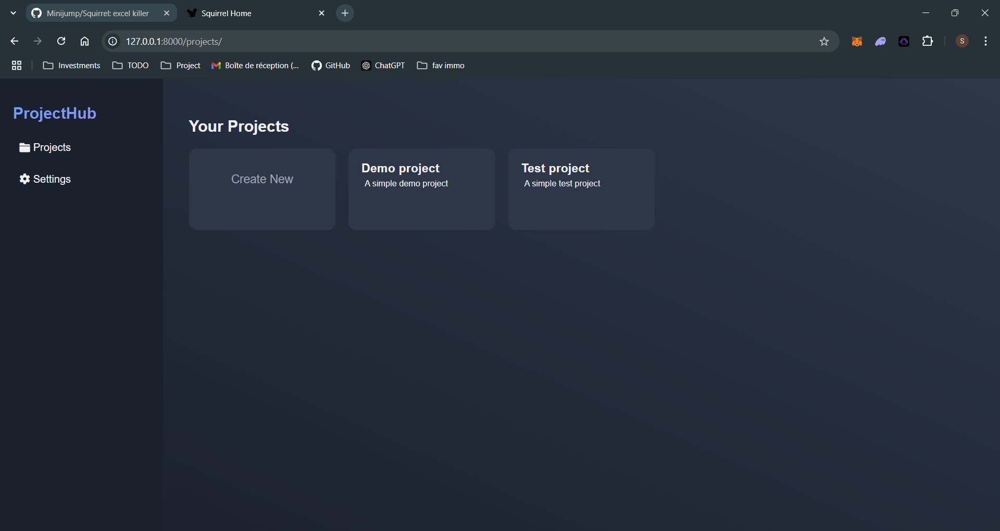
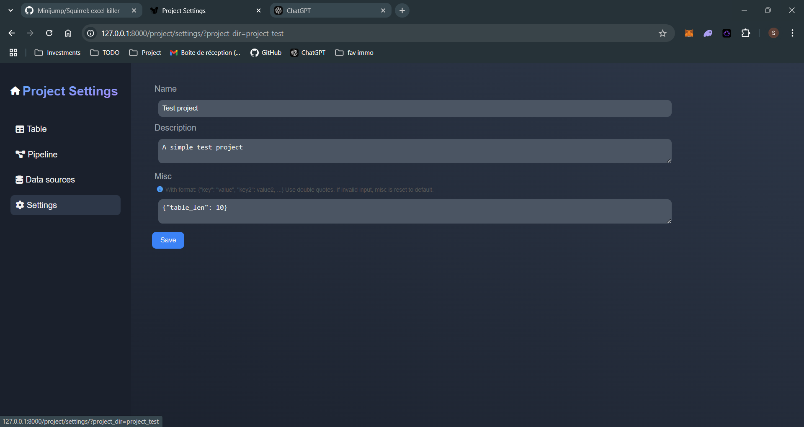
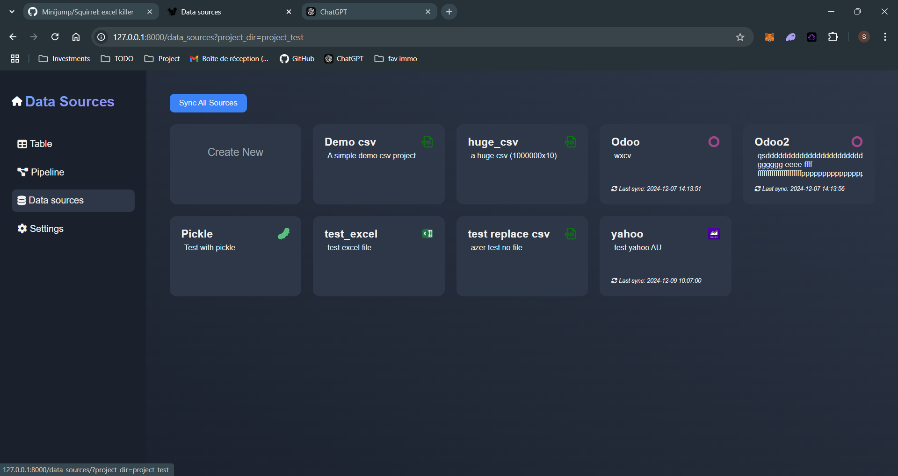
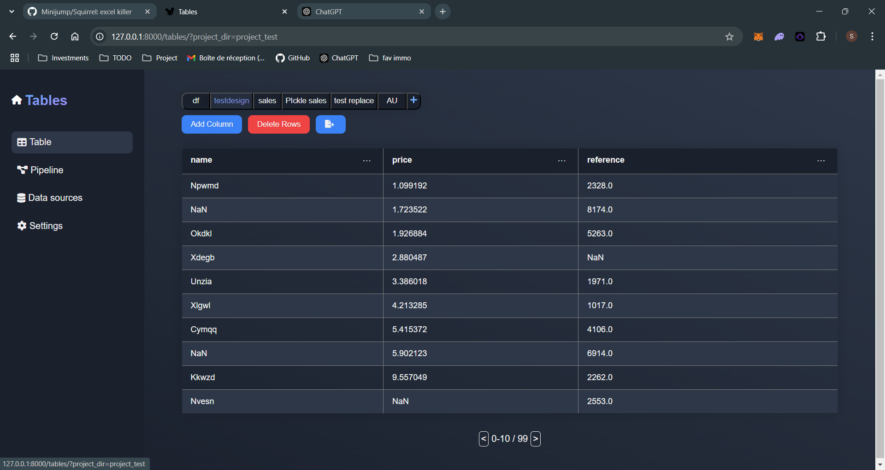
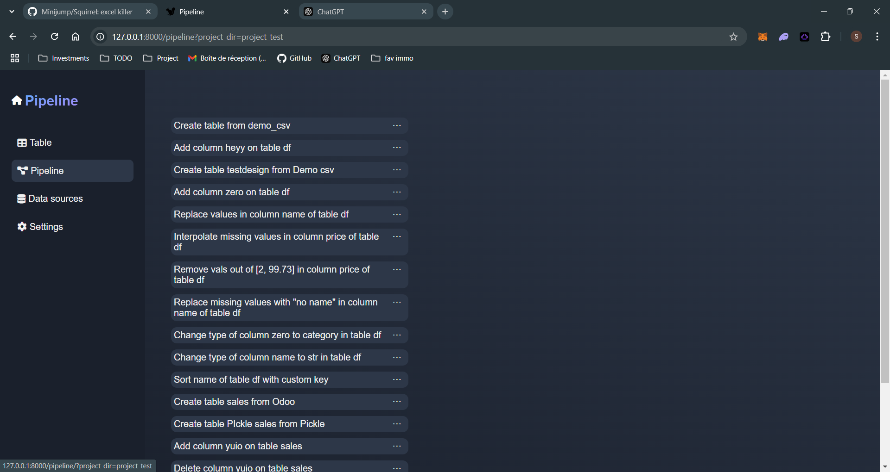

# Squirrel (Mvp)
      
Create data analysis pipeline by generating python with a low-code interface. 
## The app
### Installation

1. **Clone the repository:**
    ```sh
    git clone https://github.com/Minijump/Squirrel.git
    cd Squirrel
    ```

2. **Create a virtual environment (optional):**
    * Create the environment
        ```sh
        python -m venv venv_name
        ```
    * Activate it

        windows:
        ```sh
        .\venv_name\Scripts\activate
        ```

        Linux:
        ```sh
        source venv/bin/activate
        ```
    Note that real cowboys do not bother with v-envs and deal with problems such as conflicts when they appears. 

3. **Install the required Python packages:**
    ```sh
    pip install -r requirements.txt
    ```

### Running the Application

1. **Install a server**

    Uvicorn is not mandatory, feel free to use whatever can do the job.

    ```sh
    pip install uvicorn
    ```

2. **Start the FastAPI server:**
    ```sh
    uvicorn app.main:app
    ```
    Note that you will often see this command with '--reload' argument. Do not use it to run the app, it will cause troubles when the pipeline.py file is updated.

3. **Open your browser and navigate to:**
    ```
    http://127.0.0.1:8000
    ```

### Usage

Squirrel enables you to create new projects or work on existing ones. These projects are stored in a simple folder, allowing you to share the folder with others for collaboration. You can even convert it into a Git repository for those of you with a more technical background.



Once the project opened, you have acces to 4 pages

__The project settings:__

This page allows you to modify the settings of your project. In the current version of Squirrel, you can update the project's name, its description, and the number of lines displayed per table.



__The data sources:__

The data source page allows you to add new data sources (logic). Without creating a data source, you won't be able to create a table. The available data source types include CSV, XLSX, and Pickle, as well as Odoo and Yahoo Finance. The last two are API connections, which require additional information during source creation (such as credentials for Odoo). Once set up, the API request will be executed automatically, generating a file that can be used in the tables. If you suspect that new data is available online, you can synchronize the source (or all sources), and the file will be updated automatically.



__The tables:__

The tables page is where the action happens. On this page, you can create new tables (from existing data sources), add new columns, or delete rows from those tables. You can also "inspect" the columns and perform various actions on them.



__The pipeline:__

Every time you perform an action on a table, it is stored in the pipeline. The pipeline page provides an overview of these actions, allowing you to reorder them, edit the Python code executed by the actions, or delete them.



## Develoment

### Customize

The project structure can be somewhat strange to those accustomed to well-structured projects. Here is a brief summary of its organization:

There are 3 main folders:

* app: this folder contains the endpoints and the class used by the project
* templates: this folder contains the html templates and the statics (img, css, js) used by the project
* _projects: this is the folder that stores the user's projects. Each projects must contains a manifest, a folder data_source and a pipeline.py file

In addition to these folders, you will find a folder named tests that contains the unit tests, as well as a utils folder, which is somewhat unnecessary but included because large projects often have one.

### Running Tests

1. **Run the unit tests:**
    ```sh
    pytest ./tests
    ```
### Contributing

1. **Fork the repository**
2. **Create a new branch:**
    ```sh
    git checkout -b feature/your.feature.name
    ```
3. **Make your changes and commit them:**
    ```sh
    git commit -m 'Add a meaningfull commit message'
    ```
4. **Push to the branch:**
    ```sh
    git push origin feature/your.feature.name
    ```
5. **Create a new Pull Request**

### To do MVP
* Table: change structure => one class per action (add an action registry, with tags in arguments?, class.__name__ as key)
It will have 1 field 'request' (from where we get form data) + others (available args?...)

Copilot proposition:
Step 1: Create a base TableAction class
```py
# app/tables/actions.py
class TableAction:
    def __init__(self, request):
        self.request = request

    async def execute(self):
        raise NotImplementedError("Subclasses must implement this method")
```
Step 2: Create a registry for table actions
```py
# app/tables/actions.py
TABLE_ACTION_REGISTRY = {}

def table_action_type(cls):
    TABLE_ACTION_REGISTRY[cls.__name__] = cls
    return cls
```
Step 3: Implement specific table actions
```py
# app/tables/actions.py
@table_action_type
class AddColumn(TableAction):
    async def execute(self):
        form_data = await self.request.form()
        table_name = form_data.get("table_name")
        col_name = form_data.get("col_name")
        new_code = f"""dfs['{table_name}']['{col_name}'] = {form_data.get('col_value')}  #sq_action:Add column {col_name} on table {table_name}"""
        return new_code

@table_action_type
class RenameColumn(TableAction):
    async def execute(self):
        form_data = await self.request.form()
        table_name = form_data.get("table_name")
        col_name = form_data.get("col_name")
        new_col_name = form_data.get("new_col_name")
        new_code = f"""dfs['{table_name}'].rename(columns={{'{col_name}': '{new_col_name}'}}, inplace=True)  #sq_action:Rename column {col_name} to {new_col_name} in table {table_name}"""
        return new_code

# Add more actions as needed...
```
Step 4: Modify the router to use the registered actions
```py
# app/tables/routers/tables.py
from app.tables.actions import TABLE_ACTION_REGISTRY

@router.post("/tables/execute_action/")
async def execute_action(request: Request, action_name: str):
    ActionClass = TABLE_ACTION_REGISTRY.get(action_name)
    if not ActionClass:
        raise ValueError(f"Action {action_name} not found")

    action_instance = ActionClass(request)
    new_code = await action_instance.execute()
    return new_code
```

### To do
* Datasource: Save all in pickle (in csv datasource we would have original_source.csv; data.pkl. We would use only data.pkl in code)
* Datasource all available args
* Supabase connection, blockchain.com, json file
* Make data source sync parallel
* Data source unit tests + dedicated readme
* Do not run all pipeline at each actions (especially for pager, infos, ... Save the whole dfs dict as pickle)

### To Fix

### Feature ideas
* Odoo module; ease imports ?
* 'Dynamic' data source: sync before running the pipeline. List of dynamics in project settings
* Give a way to secure credentials?
* Great-expectation unit tests
* Export as jupyter notebook + Make folder runnable as-is outside the app (create a main.py file to run? That would sync all sources,...)???
* See diff before doing an action/ at each actions in pipeline
* Git github integration
* Multiple pipelines
* ...
