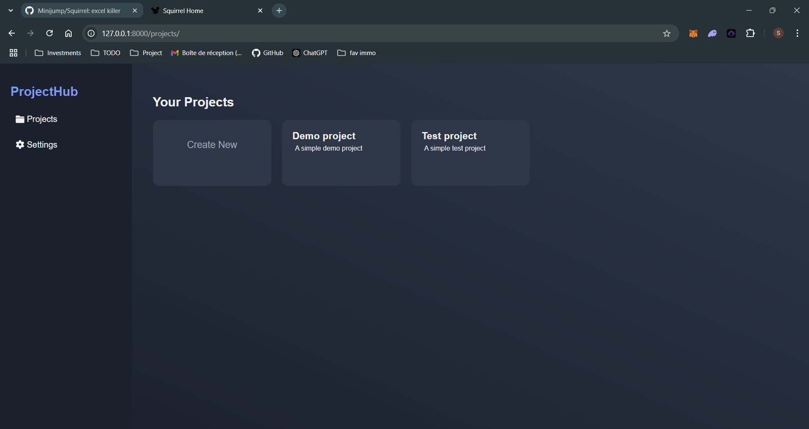
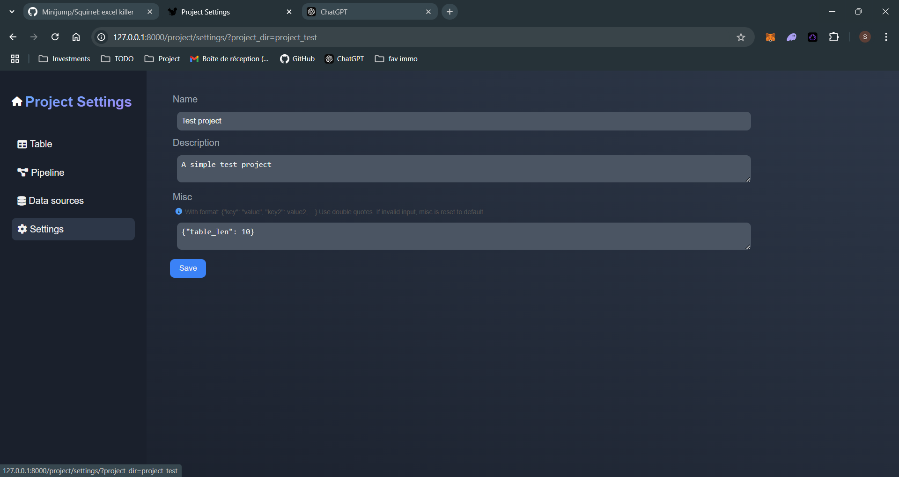
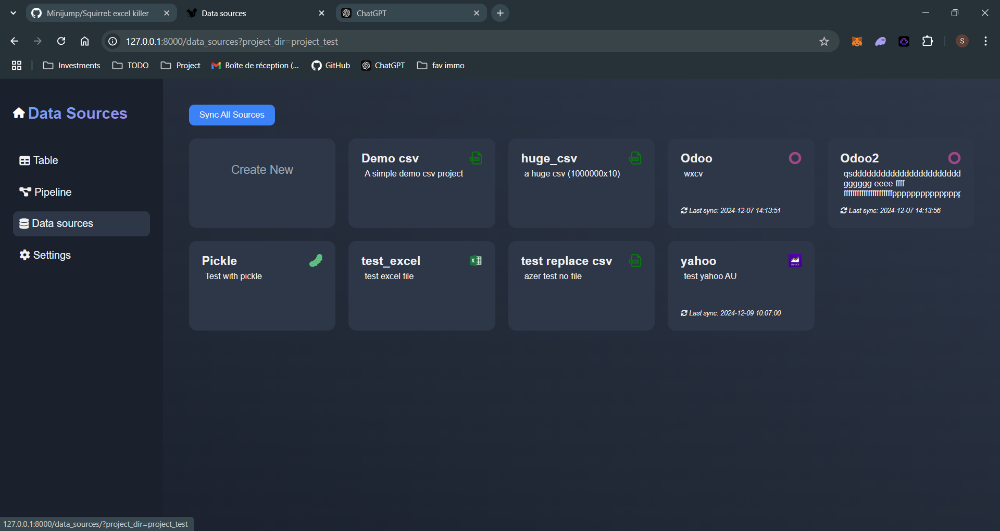
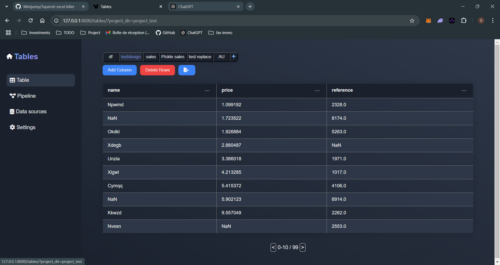
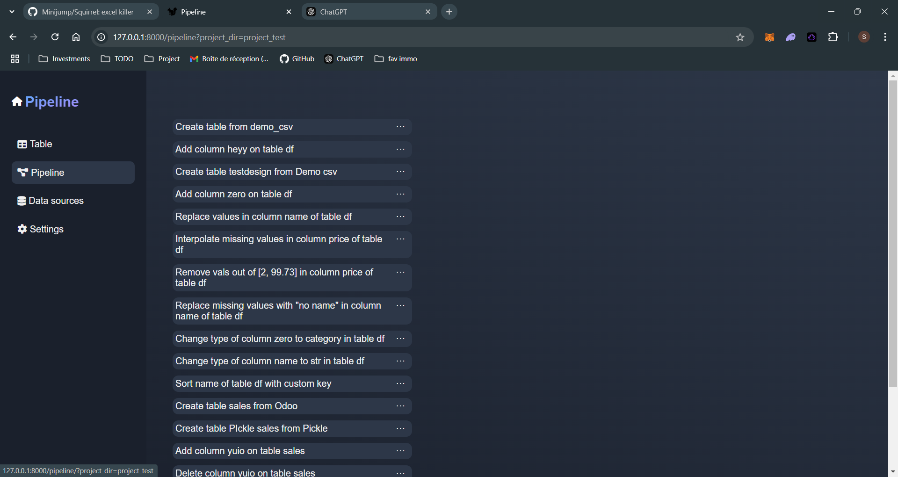

# Squirrel (Mvp)
      
Create data analysis pipeline by generating python with a low-code interface. 
## The app
### Installation

1. **Clone the repository:**
    ```sh
    git clone https://github.com/Minijump/Squirrel.git
    cd Squirrel
    git submodule update --init --recursive
    ```

2. **Create a virtual environment (optional):**
    * Create the environment
        ```sh
        python -m venv venv_name
        ```
    * Activate it

        windows:
        ```sh
        .\venv_name\Scripts\activate
        ```

        Linux:
        ```sh
        source venv/bin/activate
        ```
    Note that real cowboys do not bother with v-envs and deal with problems such as conflicts when they appears. 

3. **Install the required Python packages:**
    ```sh
    pip install -r requirements.txt
    ```

### Running the Application

1. **Install a server**

    Uvicorn is not mandatory, feel free to use whatever can do the job.

    ```sh
    pip install uvicorn
    ```

2. **Start the FastAPI server:**
    ```sh
    uvicorn app.main:app
    ```
    Note that you will often see this command with '--reload' argument. Do not use it to run the app, it will cause troubles when the pipeline.py file is updated.

3. **Open your browser and navigate to:**
    ```
    http://127.0.0.1:8000
    ```

### Usage

Squirrel enables you to create new projects or work on existing ones. These projects are stored in a simple folder, allowing you to share the folder with others for collaboration. You can even convert it into a Git repository for those of you with a more technical background.



Once the project opened, you have acces to 4 pages

__The project settings:__

This page allows you to modify the settings of your project. In the current version of Squirrel, you can update the project's name, its description, and the number of lines displayed per table.



__The data sources:__

The data source page allows you to add new data sources (logic). Without creating a data source, you won't be able to create a table. The available data source types include CSV, XLSX, and Pickle, as well as Odoo and Yahoo Finance. The last two are API connections, which require additional information during source creation (such as credentials for Odoo). Once set up, the API request will be executed automatically, generating a file that can be used in the tables. If you suspect that new data is available online, you can synchronize the source (or all sources), and the file will be updated automatically.



__The tables:__

The tables page is where the action happens. On this page, you can create new tables (from existing data sources), add new columns, or delete rows from those tables. You can also "inspect" the columns and perform various actions on them.



__The pipeline:__

Every time you perform an action on a table, it is stored in the pipeline. The pipeline page provides an overview of these actions, allowing you to reorder them, edit the Python code executed by the actions, or delete them.



## Develoment

### Customize

The project structure can be somewhat strange to those accustomed to well-structured projects. Here is a brief summary of its organization:

There are 3 main folders:

* app: this folder contains the endpoints and the class used by the project
* templates: this folder contains the html templates and the statics (img, css, js) used by the project
* _projects: this is the folder that stores the user's projects. Each projects must contains a manifest, a folder data_source and a pipeline.py file

In addition to these folders, you will find a folder named tests that contains the unit tests.

### Running Tests

1. **Run the unit tests:**
    ```sh
    pytest ./tests
    ```
### Contributing

1. **Fork the repository**
2. **Create a new branch:**
    ```sh
    git checkout -b feature/your.feature.name
    ```
3. **Make your changes and commit them:**
    ```sh
    git commit -m 'Add a meaningfull commit message'
    ```
4. **Push to the branch:**
    ```sh
    git push origin feature/your.feature.name
    ```
5. **Create a new Pull Request**

### To do
* imp all js code?
* refactor tours after code reformat: imp widget uses in tours, ... + add missing tours (test tables actions, ...) + test backend info in tours(add methods in toolbox to check table in backend, ...)
* investigate to stop using dfs ?
* complete readme

### To Fix
* Fix unit tests

### To do MVP
* Add actions

### To do UX
* Better UI: factorize classes/colors/...
* UI notification for JSONResponse ?
* UI confirm button (for deleting an action in pipeline)
* Imp modal/modal's form style
* Fix misc UI bugs: sidebar without tabs

### Feature ideas
* Add dynamic doctrsing (expl: pd.Series.replace.__doc__)
* Great-expectation unit test
* 'Dynamic' data source: sync before running the pipeline. List of dynamics in project settings + sync file source?
* See diff before doing an action/ at each actions in pipeline
* Imp pipeline (test before save? summary with blocks on the top? ...?)
* Multiple pipelines
* basic graphs (chart.js, d3.js,...?)
* Dashboards? (can be saved) (computed var)
* Widgets: autocomplete Squirrel action, lists
* Give a way to secure credentials?
* Supabase connection, blockchain.com
* Datasources are only credentials, set the request args at table creation?? Automatic creation of a source when creating a table?
* Odoo module; ease imports ?
* Git/Github integration
* integrated llm / Connection with online ones (+ crewAI?)
* df explorer for vs code? Not much in common with squirrel?
* ...
