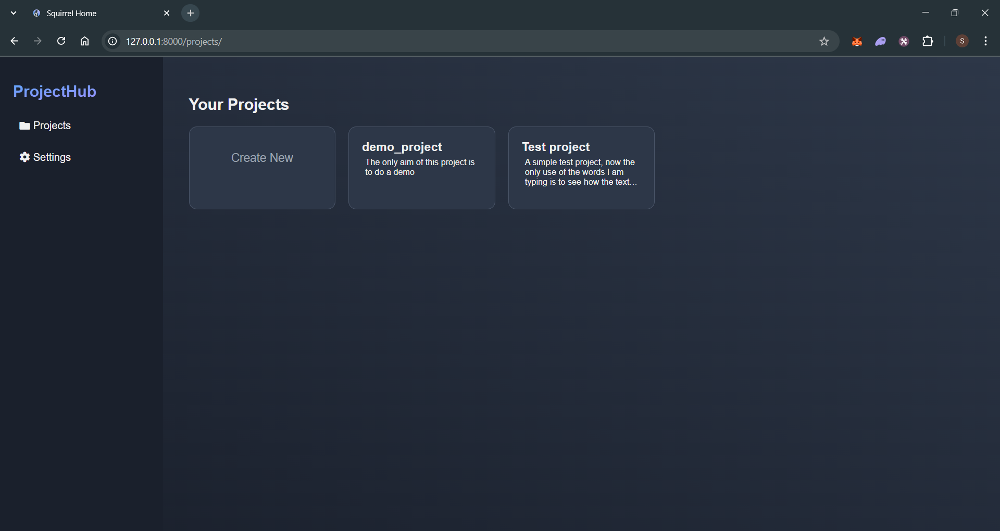
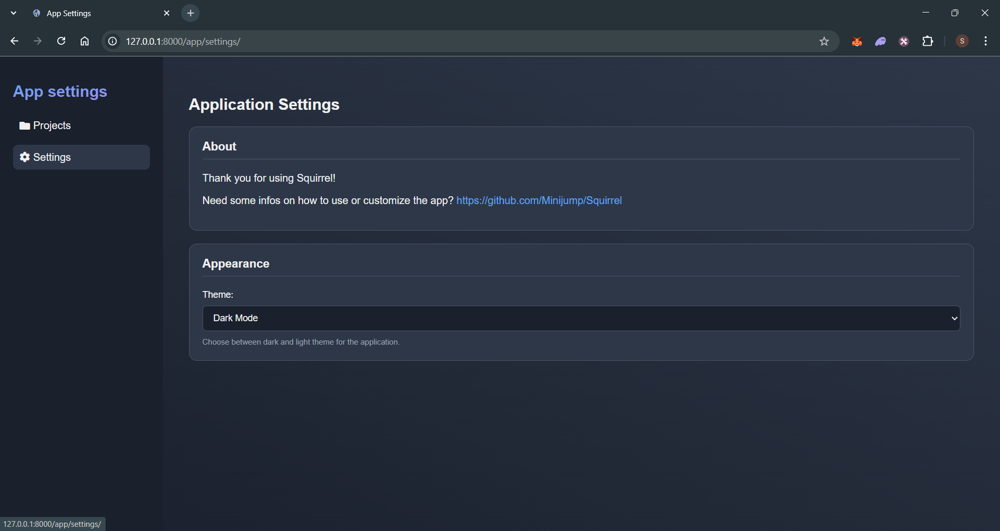
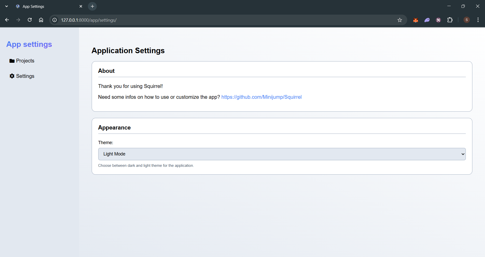
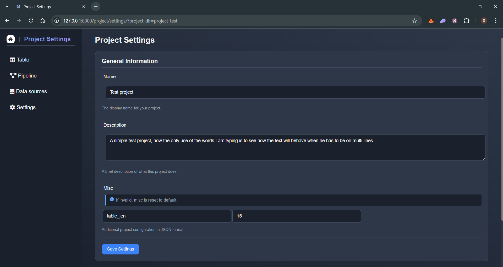
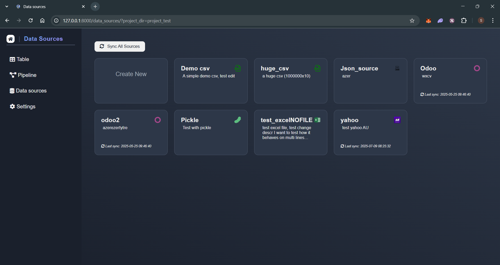
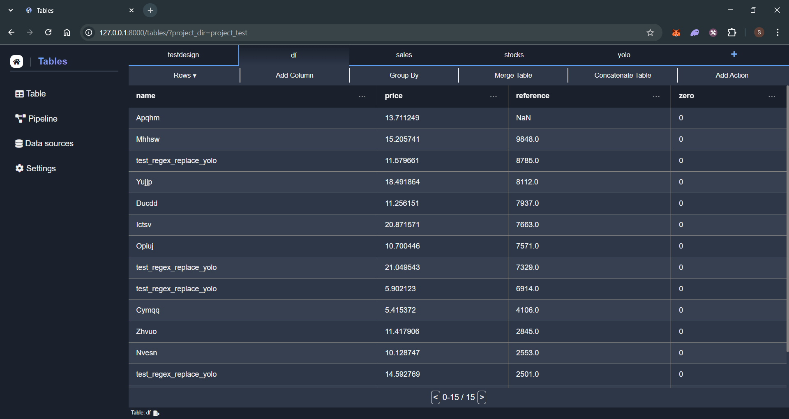
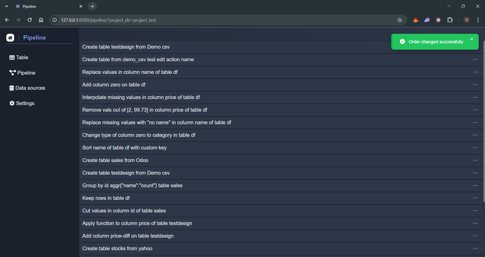

# Squirrel (Mvp)
      
Create data analysis pipeline with a no/low-code interface. 
## The app
### Installation

1. **Clone the repository:**
    ```sh
    git clone https://github.com/Minijump/Squirrel.git
    cd Squirrel
    git submodule update --init --recursive
    ```

2. **Create a virtual environment (optional):**
    * Create the environment
        ```sh
        python -m venv venv_name
        ```
    * Activate it

        windows:
        ```sh
        .\venv_name\Scripts\activate
        ```

        Linux:
        ```sh
        source venv/bin/activate
        ```
    Note that real cowboys do not bother with v-envs and deal with problems such as conflicts when they appears. 

3. **Install the required Python packages:**
    ```sh
    pip install -r requirements.txt
    ```

### Running the Application

1. **Install a server**

    Uvicorn is not mandatory, feel free to use whatever can do the job.

    ```sh
    pip install uvicorn
    ```

2. **Start the FastAPI server:**
    ```sh
    uvicorn app.main:app
    ```
    Note that you will often see this command with '--reload' argument. Do not use it to run the app, it will cause troubles when the pipeline file is updated.

3. **Open your browser and navigate to:**
    ```
    http://127.0.0.1:8000
    ```

### Usage

Squirrel enables you to create new projects or work on existing ones. These projects are stored in a simple folder, allowing you to share the folder with others for collaboration. You can even convert it into a Git repository for those of you with a more technical background.



For those who prefers white theme, you can go in the app settings to change your app preference, else the dark one is set by default.

<div style="display: flex; gap: 10px;">
  
  
</div>

__The project settings:__

Once you open a project, you can go in its settings. This page allows you to modify the settings of your project. You can update the project's name, its description, and the number of lines displayed per table.



__The data sources:__

The data source page allows you to add new data sources (logic). Without creating a data source, you won't be able to create a table. The available data source types include CSV, XLSX, JSON and Pickle, as well as Odoo and Yahoo Finance. The last two are API connections, which require additional information during source creation (such as credentials for Odoo). Once set up, the API request will be executed automatically, generating a file that can be used in the tables. If you suspect that new data is available online, you can synchronize the source (or all sources), and the file will be updated automatically.



__The tables:__

The tables page is where the action happens. On this page, you can create new tables, add new columns, ... You can also "inspect" the columns and perform various actions on them.



__The pipeline:__

Every time you perform an action on a table, it is stored in the pipeline. The pipeline page provides an overview of these actions, allowing you to reorder, edit, or delete them.



## Develoment
### Customize

The project structure can be somewhat strange to those accustomed to well-structured projects. Here is a brief summary of its organization:

There are 3 main folders:

* app: this folder contains every code required to run the app: endpoints, templates, classes, js, ...
* _projects: this is the folder that stores the user's projects. Each projects must contains a manifest and a folder data_source
* tests: this is where the unit tests and the tours lays

### Running Tests

1. **Run the unit tests:**
    ```sh
    pytest ./tests
    ```
### Contributing

1. **Fork the repository**
2. **Create a new branch:**
    ```sh
    git checkout -b feature/your.feature.name
    ```
3. **Make your changes and commit them:**
    ```sh
    git commit -m 'Add a meaningfull commit message'
    ```
4. **Push to the branch:**
    ```sh
    git push origin feature/your.feature.name
    ```
5. **Create a new Pull Request**

### To do
* Improve actions
  * Autocomplete squirrel action widget

### To Fix

### To do MVP
* Improve actions
  * ?add a apply_on decorator ...?
  * ?add a 'name' that will enable to write squirrel action easily (with autocomplete when widgets are done) from scratch?
* Add actions (expl: Possibility to edit a cell value directly)

### To do UX

### Feature ideas
* Imp JS in overall: some modal/sidebar should use default features such as fill data, bind events, ... + imp + generalize error handling + tandardize async/await patterns + ... (and check pages script, maybe create a table class instead of adding everything in script, ...)
* Basic graphs in columns inspect (chart.js, d3.js,...?)
* Data sources
  * Give a way to secure credentials? =>Add a way to add credentials in settings/data sources/new credentials tabs/... and select them at data source creation
* Pipeline
  * do not run all pipeline everytime (check if pipeline changed (with hash?), run everything only if yes, else only execute required action)
  * Imp pipeline (test before save? summary with blocks on the top? ...?)?
  * Multiples pipelines?
* Actions
  * Fields should be object instead of simple dict?
  * Add column, column_list, table, ... field type
* Secure app? If a project is shared to somebody else, we must be sure it won't run something bad for the computer? Is it even possible to do that?
* Great-expectation unit test
* Dashboard tab (custom/embedded metabase? Not sure it suits need/...)
* Odoo module; ease imports ?
* Supabase connection, blockchain.com
* Git/Github integration
* Make app executable? Use py2exe?
* ...
